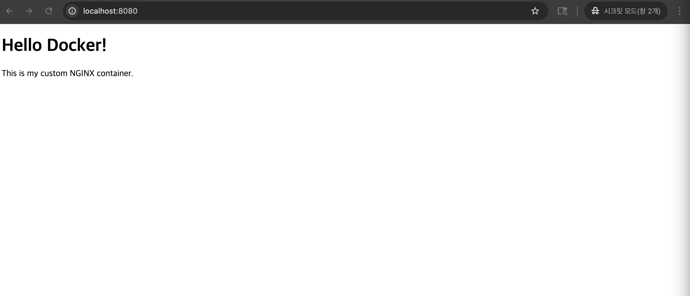
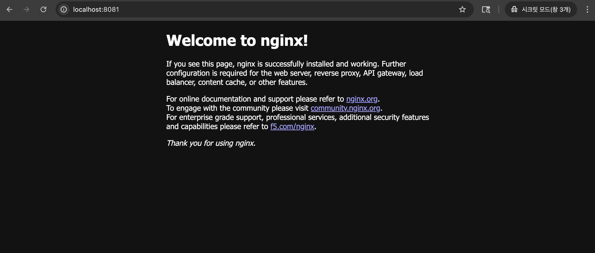
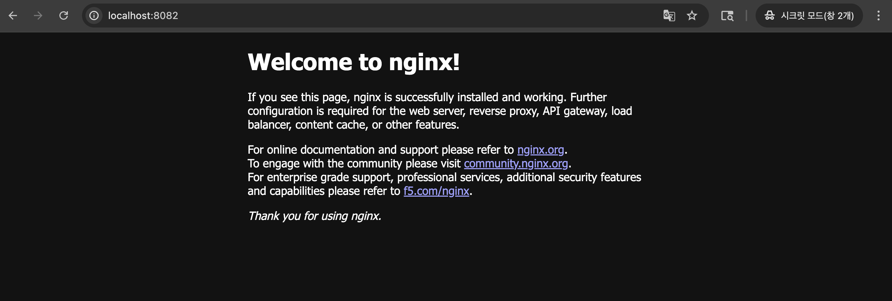
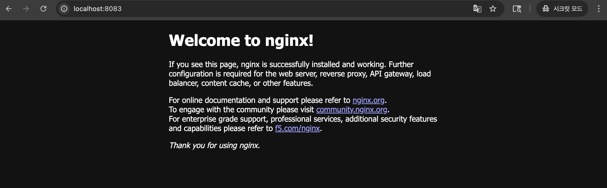
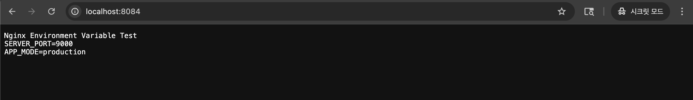
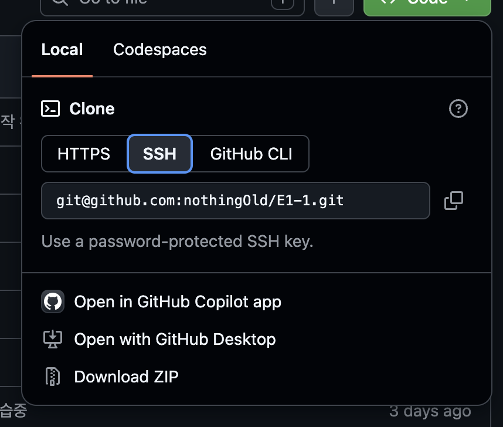

# E1-1

## 프로젝트 개요 및 학습 목표
- 터미널 + Docker + Git/GitHub를 직접 세팅하고, 재현 가능한 개발 환경을 만드는 경험
- 이 과제를 마친 후, 학습자는 아래를 스스로 설명할 수 있어야 한다.
    - 절대 경로와 상대 경로의 차이를 예시를 들어 설명할 수 있다.
    - 파일 권한의 의미(r/w/x)와 755, 644 같은 표기가 어떤 규칙으로 해석되는지 설명할 수 있다.
    - 기존 Dockerfile을 기반으로 “커스텀 이미지”를 만들 수 있다.
    - 포트 매핑이 필요한 이유를 설명할 수 있다.
    - Docker 볼륨(영속 데이터)을 설명할 수 있다.
    - Git과 GitHub의 역할 차이(로컬 버전관리 vs 원격 협업 플랫폼)를 설명할 수 있다.

## 제출물
- GitHub 저장소 하나에 모든 결과를 포함

## README.md 필수 포함 사항
- 프로젝트 개요 / 실행 환경 / 수행 체크리스트 / 검증 방법
- 트러블슈팅 2건 이상 (문제 → 원인 → 해결)
- 민감정보 마스킹

## 환경 특이사항
- macOS 사용
- OrbStack 사용 (sudo 없이 Docker 실행 가능)


---


## 실행환경
**OS**
```
sevencvter4085@c6r8s8 ~ % sw_vers
ProductName:		macOS
ProductVersion:		15.7.7
BuildVersion:		24G720
```

**쉘 종류**
```
sevencvter4085@c6r8s8 ~ % echo "$SHELL"
/bin/zsh
```

**터미널 확인**
```
sevencvter4085@c6r8s8 ~ % echo "$TERM_PROGRAM"             
Apple_Terminal
```

**도커 버전**
- OrbStack을 사용하기에 다음 상태여야 한다.
- OrbStack 실행 → Docker Engine 실행 → docker info 성공
```
sevencvter4085@c6r5s6 ~ % docker --version
Docker version 28.5.2, build ecc6942
```

```
sevencvter4085@c6r9s8 ~ % docker version
Client:
 Version:           28.5.2                    # Client 정보
 API version:       1.51                      # API 정보
 Go version:        go1.25.3                  # Go 언어 버전
 Git commit:        ecc6942                   
 Built:             Wed Nov  5 14:42:30 2025  
 OS/Arch:           darwin/amd64              # 운영체제/아키텍처
 Context:           orbstack

Server: Docker Engine - Community  # Server(데몬) 버전
 Engine:
  Version:          28.5.2
  API version:      1.51 (minimum version 1.24)
  Go version:       go1.24.9
  Git commit:       89c5e8f
  Built:            Wed Nov  5 14:45:42 2025
  OS/Arch:          linux/amd64
  Experimental:     false
 containerd:
  Version:          v2.2.0
  GitCommit:        1c4457e00facac03ce1d75f7b6777a7a851e5c41
 runc:
  Version:          1.3.3
  GitCommit:        d842d7719497cc3b774fd71620278ac9e17710e0
 docker-init:
  Version:          0.19.0
  GitCommit:        de40ad0

```

**도커 확인시 만날 수 있는 에러 상황**
```
 # 아래와 같은 출력이 나오면 데몬이 죽어있다는 의미이다.
Server:
Cannot connect to the Docker daemon at unix:///Users/sevencvter4085/.orbstack/run/docker.sock. Is the docker daemon running?
```

**Git 버전**
```
sevencvter4085@c6r8s8 ~ % git --version
git version 2.53.0
```


---


## 수행 항목 체크리스트
- [x] 터미널 조작 로그 (위치/목록/생성/저장/읽기/복사·내용확인/이름변경·이동/삭제)
- [x] 권한 실습 (파일 1개 + 디렉토리 1개, 전/후 비교)
- [x] Docker 설치 점검 (version, info)
- [x] Docker 기본 운영 (images/ps/logs/stats)
- [x] 컨테이너 실행 (hello-world, ubuntu 진입)
- [x] 커스텀 이미지 (Dockerfile 직접 작성 → 빌드·실행 성공)
- [x] 포트 매핑 접속 증거 (주소창+응답화면 함께)
- [x] 볼륨 영속성 검증 (삭제 전/후 데이터 유지)
- [x] Git 설정 (config --list)
- [x] GitHub 연동 증거
- [x] 민감정보 마스킹 완료


---


## 1) 터미널 조작
- 현재 위치 확인, 목록 확인(숨김 파일 포함), 이동, 생성, 복사, 이동/이름변경, 삭제
- 파일 내용 확인, 빈 파일 생성

1. pwd                      # 현재 위치 확인
2. ls -al                   # 목록 확인 (숨김 파일 포함, -a)
3. mkdir test_dir           # 디렉토리 생성
4. cd test_dir              # 이동
5. touch empty.txt          # 빈 파일 생성
6. echo "hello" > file.txt  # 파일 내용 작성
7. cat file.txt             # 파일 내용 확인
8. cp file.txt copy.txt     # 복사
9. mv copy.txt renamed.txt  # 이동/이름변경
10. rm renamed.txt          # 삭제
<br>
<br>

1). 현재위치 확인
```
sevencvter4085@c6r5s6 E1-1 % pwd
/Users/sevencvter4085/Documents/E1-1
```

2). 목록 확인(숨김 파일 포함)
- `-a`: 숨김 파일(.으로 시작하는 파일)을 포함한 모든 파일/디렉토리 이름 출력
    - 숨김 파일(dotfile)을 포함하여 현재 디렉토리 안에 있는 모든 항목의 이름만 나열
    - 리눅스에서는 파일명이나 디렉토리명이 `.`으로 시작하면 숨김 처리 (.bashrc, .git 등)

- `-l`: 일반 파일/디렉토리의 상세 정보(권한, 소유자, 용량, 수정일 등)를 한 줄씩 출력
    - 숨김 파일을 제외한 일반 파일/디렉토리를 리스트 형태로 상세하게 확인
    - 표시되는 항목: 권한 | 링크 수 | 소유자 | 그룹 | 파일 크기 | 최종 수정 시간 | 이름
    - 권한 정보의 가장 첫 글자가 파일의 종류를 나타낸다.
        - `d` (Directory): 디렉토리 (폴더)
        - `-` (Regular File): 일반 파일 (텍스트, 이미지 등)
        - `l` (Link): 심볼릭 링크 (Mac의 '가상본/바로가기')
        - `x`(eXecute)가 들어있으면 실행 가능한 프로그램/스크립트

- `-al`: 숨김 파일을 포함한 모든 파일의 상세 정보를 출력
    - `-a`와 `-l` 옵션을 합친 형태입니다.
    - `.`, `..`을 포함한 모든 파일과 디렉토리의 상세 정보를 출력합니다.
    - 개발 및 환경 설정 작업 시 가장 흔하게 사용되는 조합입니다.

```
sevencvter4085@c6r8s8 E1-1 % ls -a
.		.DS_Store	image		README.md
..		.git		mission1.md	test_dir

sevencvter4085@c6r8s8 E1-1 % ls -l 
total 72
drwxr-xr-x  5 sevencvter4085  sevencvter4085    160  7 30 21:35 image
-rw-r--r--  1 sevencvter4085  sevencvter4085  12590  7 30 21:35 mission1.md
-rw-r--r--  1 sevencvter4085  sevencvter4085  19004  7 30 23:24 README.md
drwxr-xr-x  4 sevencvter4085  sevencvter4085    128  7 30 23:32 test_dir

sevencvter4085@c6r8s8 E1-1 % ls -al
total 88
drwxr-xr-x   8 sevencvter4085  sevencvter4085    256  7 30 23:32 .
drwx------+  5 sevencvter4085  sevencvter4085    160  7 30 23:28 ..
-rw-r--r--   1 sevencvter4085  sevencvter4085   6148  7 30 23:30 .DS_Store
drwxr-xr-x  12 sevencvter4085  sevencvter4085    384  7 30 21:36 .git
drwxr-xr-x   5 sevencvter4085  sevencvter4085    160  7 30 21:35 image
-rw-r--r--   1 sevencvter4085  sevencvter4085  12590  7 30 21:35 mission1.md
-rw-r--r--   1 sevencvter4085  sevencvter4085  19004  7 30 23:24 README.md
drwxr-xr-x   4 sevencvter4085  sevencvter4085    128  7 30 23:32 test_dir
```


3). 디렉토리 생성
```
sevencvter4085@c6r5s6 E1-1 % mkdir test_dir
```

4). 디렉토리 이동
```
sevencvter4085@c6r5s6 E1-1 % cd test_dir
```

5). 빈 파일 생성
```
sevencvter4085@c6r5s6 E1-1 test_dir % touch empty.text
sevencvter4085@c6r8s8 test_dir % ls
empyt.txt
```

6). 파일 내용 작성
```
sevencvter4085@c6r5s6 E1-1 test_dir % echo "hello" > file.txt
```

7). 파일 내용 확인
```
sevencvter4085@c6r5s6 E1-1 test_dir % cat file.txt
hello
```

8). 복사
```
sevencvter4085@c6r8s8 test_dir % cp file.txt copy.txt
sevencvter4085@c6r8s8 test_dir % ls
copy.txt	empyt.txt	file.txt
```

9). 파일명 변경 및 이동
```
sevencvter4085@c6r8s8 test_dir % mv copy.txt renamed.txt
sevencvter4085@c6r8s8 test_dir % ls
empyt.txt	file.txt	renamed.txt

sevencvter4085@c6r8s8 test_dir % mv file.txt ../      
sevencvter4085@c6r8s8 test_dir % ls
empyt.txt	renamed.txt

sevencvter4085@c6r8s8 test_dir % 
sevencvter4085@c6r8s8 test_dir % cd ..
sevencvter4085@c6r8s8 E1-1 % ls
file.txt	image		mission1.md	README.md	test_dir
```

10). 파일 삭제
```
sevencvter4085@c6r5s6 E1-1 % rm file.txt
sevencvter4085@c6r8s8 E1-1 % ls
image		mission1.md	README.md	test_dir
```

**절대 경로를 쓸 때**
- 스크립트/서비스가 어느 위치에서 실행될지 모를 때 (cron, systemd 등)
- Docker, CI/CD 설정처럼 환경이 고정되어 있을 때
- 헷갈리면 안 되는 시스템 설정 파일 경로

**상대 경로를 쓸 때**
- 프로젝트 내부에서 파일끼리 참조할 때 (코드 import, HTML 리소스 등)
- 어디서든 clone해서 쓸 수 있어야 할 때 (이식성)
- 팀 협업 프로젝트에서 내 로컬 경로를 하드코딩하면 안 될 때

**절대/상대경로 요약**
- 실행위치가 고정이면 `절대 경로`
- 프로젝트가 이동해도 동작해야 하면 `상대 경로`

---

## 2) 권한 실습
- 권한을 확인/변경하는 명령을 수행하고, 변경 전/후 비교를 기술 문서에 남긴다.
- 최소 요구: 파일 1개, 디렉토리 1개에 대해 권한 변경 실험을 수행한다.

- 소유자(owner)/그룹(group)/기타(ohers) 3자리
    - `r`=4, `w`=2, `x`=1, `-`=0
    - 권한을 3글자씩 나눠서 숫자로 변환
        - 1번째	1글자 파일 종류
        - 2~4번째 3글자	소유자 권한
        - 5~7번째 3글자	그룹 권한
        - 8~10번째 3글자 기타 사용자 권한
    - `755` = `-rwxr-xr-x`, `644` = `-rw-r--r--`

| 권한    |   이진수 | 8진수 | 의미          |
| ----- | ----: | --: | ------------    |
| `rwx` | `111` | `7` | 읽기 + 쓰기 + 실행 |
| `rw-` | `110` | `6` | 읽기 + 쓰기       |
| `r-x` | `101` | `5` | 읽기 + 실행       |
| `r--` | `100` | `4` | 읽기만           |
| `---` | `000` | `0` | 권한 없음         |


파일 권한 실험
```
sevencvter4085@c6r5s6 E1-1 % ls -l file.txt
-rw-r--r--  1 sevencvter4085  sevencvter4085  6 Jul 29 21:35 file.txt
sevencvter4085@c6r5s6 E1-1 % chmod 755 file.txt
sevencvter4085@c6r5s6 E1-1 % ls -l file.txt    
-rwxr-xr-x  1 sevencvter4085  sevencvter4085  6 Jul 29 21:35 file.txt
```

디렉토리 권한 실험
```
sevencvter4085@c6r5s6 E1-1 % ls -ld test_dir   
drwxr-xr-x  2 sevencvter4085  sevencvter4085  64 Jul 29 21:34 test_dir
sevencvter4085@c6r5s6 E1-1 % chmod 644 test_dir
sevencvter4085@c6r5s6 E1-1 % ls -ld test_dir   
drw-r--r--  2 sevencvter4085  sevencvter4085  64 Jul 29 21:34 test_dir
```


---


## 3) Docker 설치 및 기본 점검
**README.md 상단에 환경 특이사항 확인 필요**
- Docker 버전 확인 결과를 기록한다. (docker --version)
- Docker 데몬 동작 여부 확인 결과를 기록한다. (docker info 또는 동등 점검)
- OrbStack이 켜진 상태에서 아래 명령어로 상태를 점검
<br>

**도커 버전**
- OrbStack을 사용하기에 다음 상태여야 한다.
- OrbStack 실행 → Docker Engine 실행 → docker info 성공
- Sever 부분이 나오면 데몬이 살아있다는 증거이다.
```
sevencvter4085@c6r5s6 ~ % docker --version
Docker version 28.5.2, build ecc6942
```

**상세버전**
- Sever 부분이 나오면 데몬이 살아있다는 증거이다.
- 맨 아래 `WARNING`은 Docker가 기본적으로 사용하는 `iptables`리리눅스 방화벽 기능이 비활성화되어 있어서 발생한다. 컨테이너에 중요한 정보가 없고 외부망에 노출된 환경도 아니므로 무시했다.


```
sevencvter4085@c6r9s8 ~ % docker version
Client:
 Version:    28.5.2
 Context:    orbstack
 Debug Mode: false
 Plugins:
  buildx: Docker Buildx (Docker Inc.)
    Version:  v0.29.1
    Path:     /Users/sevencvter4085/.docker/cli-plugins/docker-buildx
  compose: Docker Compose (Docker Inc.)
    Version:  v2.40.3
    Path:     /Users/sevencvter4085/.docker/cli-plugins/docker-compose

Server:
 Containers: 2
  Running: 1
  Paused: 0
  Stopped: 1
 Images: 1
 Server Version: 28.5.2
 Storage Driver: overlay2
  Backing Filesystem: btrfs
  Supports d_type: true
  Using metacopy: false
  Native Overlay Diff: true
  userxattr: false
 Logging Driver: json-file
 Cgroup Driver: cgroupfs
 Cgroup Version: 2
 ...

WARNING: DOCKER_INSECURE_NO_IPTABLES_RAW is set
```

**도커 확인시 만날 수 있는 에러 상황**
```
 # 아래와 같은 출력이 나오면 데몬이 죽어있다는 의미이다.
Server:
Cannot connect to the Docker daemon at unix:**** Is the docker daemon running?
```


## 4) Docker 기본 운영 명령 수행
- 이미지: 다운로드/목록 확인 (예: docker images)
- 컨테이너: 실행/중지/목록 확인 (예: docker ps, docker ps -a)
- 운영: 로그 확인 (예: docker logs), 리소스 확인 (예: docker stats)

- 이미지(Image)
    - 컨테이너를 만들기 위한 설계도
    - 읽기 전용(수정불가)
    - Docker Hub에서 다운받거나 직접 만들기 가능
    - 쉽게 말하면 어떤 환경을 어떤 상태로 실행할지 저장해놓은 파일 묶음
    - 내 실행 환경을 그대로 복사해서 어디서든 똑같이 실행할 수 있게 만든것
        - ex) 팀장이 환경 설정 후 이미지 생성 → Docker Hub에 이미지 업로드 → 팀원들이 이미지 다운로드 → 전원 동일한 환경에서 실행  
    

- 컨테이너(Container)
    - 이미지를 실행한 결과물
    - 이미지로부터 만들어지고 실행/중지/삭제 가능
    - 이미지의 환경이 내 컴퓨터에서 독립된 공간으로 작동
    - 같은 이미지로 여러 개를 만들 수 있고 서로 격리

**파이썬 venv와 Docker 차이**
| 파이썬 가상환경 (`venv`) | 개념 / 설명 | 도커 (`Docker`) |
| :--- | :---: | :--- |
| `requirements.txt` | **필요 패키지/환경 설정 파일** | `Dockerfile` |
| `venv` 생성 | **독립된 환경 구축 (파일로 고정)** | 이미지 빌드 (`docker build`) |
| `venv` 활성화 (`activate`) | **독립된 실행 공간 켜기** | 컨테이너 실행 (`docker run`) |
  

1. 이미지 목록 확인
    - `docker images` → 내 PC에 있는 이미지 목록
2. 이미지 가져오기
    - `docker pull nginx` → Docker Hub에서 nginx 이미지를 다운로드
3. 컨테이너 실행 (run)
    - `docker run -d --name my-web nginx`
    - `run`
        - Docker run은 내무적으로 두 작업을 한 번에 수행한다.
            - docker create, docker start
            - 따라서 이미 존재하는 컨테이너를 다시 실행하는 명령어가 아니라, 새 컨테이너를 만들어 실행하는 명령어이다.
    - `-d`: 백그라운드 실행(detached)
        -  -d는 detached mode로 백그라운드 실행 모드를 의미한다.
        - -d를 사용하면 Nginx가 실행된 상태에서도 터미널을 계속 사용할 수 있다.
        - 실행 결과로는 긴 문자열이 출력 될수 있는데 이 문자열은 생성된 컨테이너의 컨테이너 ID 이다.
        - -d를 사용하지 않으면 컨테이너가 터미널의 현재 화면에 연결되어 실행된다. 터미널에 Nginx 로그가 출력되고, 해당 터미널을 바로 사용하기 불편해진다.
    - `--name my-web`: 컨테이너 이름 지정
        - 생성할 컨테이너의 이름을 my-web으로 지정한다.
        - 컨테이너 이름을 지정하지 않으면 Docker가 임의의 이름을 생성한다.
        - 이름을 지정하면 이후 명령어에서 컨테이너ID 대신 지정한 이름을 사용할 수 있다.
            - docker stop my-web
            - docker start my-web
            - docker logs my-web
            - docker rm my-web
    - `nginx`: 사용할 이미지
        - 컨테이너를 만들 때 사용할 Docker 이미지 이름이다.
        - 즉, Docker Hub에 있는 공식 Nginx 이미지를 사용하겠다는 의미이다.
        - 로컬 컴퓨터에 nginx 이미지가 없다면 Docker는 자동으로 다음 과정을 수행한다.
            1) 로컬에 nginx 이미지가 있는지 확인
            2) 없으면 Docker Hub에서 nginx 이미지 다운로드
            3) nginx 이미지로 컨테이너 생성
            4) 컨테이너 실행

4. Docker는 docker run -d --name my-web nginx 이 명령어를 받으면 다음 순서로 동작한다.
    1) 로컬에 nginx:latest 이미지가 있는지 확인한다.
    2) 이미지가 없으면 Docker Hub에서 내려받는다.
    3) nginx 이미지로 새로운 컨테이너를 만든다.
    4) 컨테이너 이름을 my-web으로 지정한다.
    5) Nginx를 백그라운드에서 실행한다.

5. 주의할 점(트러블슈팅)
    - 같은 이름의 컨테이너가 이미 존재한다면 다음과 같은 충돌 오류가 발생한다.
        - The container name "/my-web" is already in use
    - 이 경우 기존 컨테이너를 삭제하거나 다른 이름을 사용해야 한다.
        - docker rm -f my-web
    - 실행 중인 Docker는 `Ctrl+C`로 종료 가능

6. 실행 중인 컨테이너 확인
    - `docker ps` → 실행 중인 것만
    - `docker ps -a` → 중지된 것 포함 전체

7. 컨테이너 중지 / 삭제
    - `docker stop my-web` → 중지
    - `docker rm my-web` → 삭제

**전체 흐름**
[준비]  images(확인) → pull(가져오기) → images(재확인)
[실행]  run(실행) → ps(실행 확인)
[운영]  logs(로그 확인) → stats(리소스 확인)
[정리]  stop(중지) → rm(삭제)


**이미지 목록 확인**
**현재 이미지 목록 확인(작업전)**
```
sevencvter4085@c6r9s8 E1-1 % docker images
REPOSITORY   TAG       IMAGE ID   CREATED   SIZE
```

**이미지 가져오기**
```
sevencvter4085@c6r9s8 E1-1 % docker pull hello-world
Using default tag: latest
latest: Pulling from library/hello-world
4f55086f7dd0: Pull complete 
Digest: sha256:c3cbe1cc1aa588a64951ac6286e0df7b27fe2e6324b1001c619bb358770c0178
Status: Downloaded newer image for hello-world:latest
docker.io/library/hello-world:latest
```

**이미지 목록 재확인(작업 후)**
```
sevencvter4085@c6r9s8 E1-1 % docker images          
REPOSITORY    TAG       IMAGE ID       CREATED        SIZE
hello-world   latest    e2ac70e7319a   4 months ago   10.1kB
```

**컨테이너 실행 및 확인**
**hello-world는 실행 후 바로 종료**
**docker ps는 실행 중인 컨테이너 확인이라 출력에 포함 되지 않음**
**docker ps -a로 종료된 컨테이너 확인시 hello-world 컨테이너 STATUS(Exited) 확인 가능**
```
sevencvter4085@c6r9s8 ~ % docker run hello-world

Hello from Docker!
This message shows that your installation appears to be working correctly.

To generate this message, Docker took the following steps:
 1. The Docker client contacted the Docker daemon.
 2. The Docker daemon pulled the "hello-world" image from the Docker Hub.
    (amd64)
 3. The Docker daemon created a new container from that image which runs the
    executable that produces the output you are currently reading.
 4. The Docker daemon streamed that output to the Docker client, which sent it
    to your terminal.

To try something more ambitious, you can run an Ubuntu container with:
 $ docker run -it ubuntu bash

Share images, automate workflows, and more with a free Docker ID:
 https://hub.docker.com/

For more examples and ideas, visit:
 https://docs.docker.com/get-started/

sevencvter4085@c6r9s8 ~ % docker ps
CONTAINER ID   IMAGE     COMMAND   CREATED   STATUS    PORTS     NAMES

sevencvter4085@c6r9s8 ~ % docker ps -a
CONTAINER ID   IMAGE         COMMAND    CREATED          STATUS                      PORTS     NAMES
9677d488f331   hello-world   "/hello"   21 seconds ago   Exited (0) 20 seconds ago             confident_brahmagupta
```

**docker logs**
**위에서 docker ps -a 로 확인 된 CONTINAER ID를 이용**
```
sevencvter4085@c6r9s8 ~ % docker logs 9677d488f331

Hello from Docker!
This message shows that your installation appears to be working correctly.

To generate this message, Docker took the following steps:
 1. The Docker client contacted the Docker daemon.
 2. The Docker daemon pulled the "hello-world" image from the Docker Hub.
    (amd64)
 3. The Docker daemon created a new container from that image which runs the
    executable that produces the output you are currently reading.
 4. The Docker daemon streamed that output to the Docker client, which sent it
    to your terminal.

To try something more ambitious, you can run an Ubuntu container with:
 $ docker run -it ubuntu bash

Share images, automate workflows, and more with a free Docker ID:
 https://hub.docker.com/

For more examples and ideas, visit:
 https://docs.docker.com/get-started/

```

**docker stats**
**stats의 기본 동작은 실시간 모니터링이다.**
**--no-stream 을 붙이면 스냅샷(현재 상태 한 번만 찍기) 확인이 가능하다**
**hello-world는 실행 후 바로 종료 되기 때문에 기록은 있지만 전부 0B/0으로 껍데기만 남은 상태이다.**
```
sevencvter4085@c6r9s8 ~ % docker stats --no-stream 9677d488f331
CONTAINER ID   NAME                    CPU %     MEM USAGE / LIMIT   MEM %     NET I/O   BLOCK I/O   PIDS
9677d488f331   confident_brahmagupta   0.00%     0B / 0B             0.00%     0B / 0B   0B / 0B     0
``` 


## 5) 컨테이너 실행
**hello-world 실행**
```
sevencvter4085@c6r9s8 ~ % docker run hello-world

Hello from Docker!
This message shows that your installation appears to be working correctly.

To generate this message, Docker took the following steps:
 1. The Docker client contacted the Docker daemon.
 2. The Docker daemon pulled the "hello-world" image from the Docker Hub.
    (amd64)
 3. The Docker daemon created a new container from that image which runs the
    executable that produces the output you are currently reading.
 4. The Docker daemon streamed that output to the Docker client, which sent it
    to your terminal.

To try something more ambitious, you can run an Ubuntu container with:
 $ docker run -it ubuntu bash

Share images, automate workflows, and more with a free Docker ID:
 https://hub.docker.com/

For more examples and ideas, visit:
 https://docs.docker.com/get-started/
```


**ubuntu 실행**
- ubuntu 컨테이너를 실행하고 내부 진입 후 간단 명령(예: `ls`, `echo`) 수행 결과를 기록
- `-i`는 입력 가능(interactive) → 키보드 입력을 컨테이너에 전달
- `-t`는 터미널 화면 표시(tty)    → 터미널 화면을 사용할 수 있도록 연결
- `/bin/bash`                → 컨테이너 안에서 실행할 프로그램

**이미지 리스트 확인**
```
sevencvter4085@c6r8s8 ~ % docker images
REPOSITORY   TAG       IMAGE ID   CREATED   SIZE
```

**우분투 이미지 다운로드**
```
sevencvter4085@c6r8s8 ~ % docker pull ubuntu
Using default tag: latest
latest: Pulling from library/ubuntu
ed819469700f: Pull complete 
a3679419df18: Pull complete 
Digest: sha256:3131b4cc82a783df6c9df078f86e01819a13594b865c2cad47bd1bca2b7063bb
Status: Downloaded newer image for ubuntu:latest
docker.io/library/ubuntu:latest
```


**우분투 실행**
```
sevencvter4085@c6r8s8 ~ % docker run -it ubuntu /bin/bash
root@ea9cb3a4cc37:/# 
```

**실행된 컨테이너 내부에서 현재 위치 확인**
```
root@ea9cb3a4cc37:/# pwd
/
```

**파일 목록 확인**
```
root@ea9cb3a4cc37:/# ls
bin   dev  home  lib64  mnt  proc  run   srv  tmp  var
boot  etc  lib   media  opt  root  sbin  sys  usr
```

**메세지 출력**
```
root@ea9cb3a4cc37:/# echo "hello ubuntu"
hello ubuntu
```

**운영제체 정보 확인**
```
root@ea9cb3a4cc37:/# cat /etc/os-release
PRETTY_NAME="Ubuntu 26.04 LTS"
NAME="Ubuntu"
VERSION_ID="26.04"
VERSION="26.04 LTS (Resolute Raccoon)"
VERSION_CODENAME=resolute
ID=ubuntu
ID_LIKE=debian
HOME_URL="https://www.ubuntu.com/"
SUPPORT_URL="https://help.ubuntu.com/"
BUG_REPORT_URL="https://bugs.launchpad.net/ubuntu/"
PRIVACY_POLICY_URL="https://www.ubuntu.com/legal/terms-and-policies/privacy-policy"
UBUNTU_CODENAME=resolute
LOGO=ubuntu-logo
```

**컨테이너 종료/유지(attach/exec 등)의 차이를 스스로 관찰하고 간단히 정리**
- `attach`, `exec`는 `docker run`, `docker start`와 같이 컨테이너 시작 명령어가 아니다.
- 둘다 컨테이너가 실행중일 때 쓰는 명령어이다.
    - 컨테이너 실행중인 상태에서
        - `docker attach` → 실행중인 컨테이너 메인 프로세스에 연결
        - `docker exec` → 실행중인 컨테이너에 새 명령 추가 실행
- 쉽게 비유하면
    - `컨테이너` = 실행중인 프로그램 (예: 서버)
    - `attach` = 그 프로그램 창에 직접 들어가기
    - `exec` = 그 프로그램 옆에서 별도 작업하기

- attach / exec 명령어 구조 차이
    - attach
        - 새로운 프로세스를 만드는게 아니라 이미 실행 중인 컨테이너에 연결하는 것이다.
        - 연결할 컨테이너만 지정하면 된다.
        - `docker attach 컨테이너명`
    - exec
        - 실행 중인 컨테이너 안에서 새로운 명령어를 실행한다.
        - 어떤 명령어를 실행할지 반드시 지정해야 한다.
        - `docker exec 컨테이너명 실행할_명령어`

- attach를 쓰는 상황 2가지
    1. Ctrl + P, Ctrl + Q로 컨테이너에서 분리한 뒤 기존 화면에 다시 연결할 때
    2. 실행 중인 컨테이너의 메인 프로세스 화면이나 출력을 직접 확인할 때
    - 핵심은 실행 중인 컨테이너의 기존 메인 프로세스에 다시 연결하는 것이다.
    - 컨테이너 A와 B 사이를 이동하는 전용 명령어는 아니다.
    - 호스트 터미널에서 docker attach A, docker attach B처럼 각각 연결할 수 있다.
    - Ctrl + P, Ctrl + Q로 나오면 컨테이너는 계속 실행된다.
    - 메인 프로세스가 셸인 경우 exit를 입력하면 메인 셸이 종료되어 컨테이너도 종료될 수 있다.
   
- exec를 쓰는 상황
    1. 컨테이너 안에 직접 들어가지 않고 명령어 하나만 실행할 때
    2. 실행 중인 컨테이너 안에서 새로운 셸을 실행하여 내부에 들어갈 때
    3. 기존 메인 프로세스에 영향을 주지 않고 점검이나 추가 작업을 할 때
    - exec로 실행한 명령이 끝나도 기존 메인 프로세스는 계속 실행된다.
    - exec로 실행한 셸에서 exit를 입력해도 해당 셸만 종료되고 컨테이너는 보통 계속 실행된다.

- exec 사용법
    - 컨테이너에 들어가지 않고 ls만 실행
        - `docker exec B ls`
    - B 컨테이너 안에서 새로운 셸을 실행하여 들어감
        - `docker exec -it B /bin/sh`
    - 이미 컨테이너 안에 들어가 있다면 docker exec를 사용하지 않고 명령어만 직접 입력한다.
        - `ls`
    - `/bin/sh`, `/bin/bash` 등 사용할 수 있는 셸은 이미지마다 다르다.

| 옵션 / 인자 | 설명 |
| :--- | :--- |
| `-d` | 컨테이너를 백그라운드에서 실행 |
| `-i` | 입력 가능한 상태 유지 |
| `-t` | 터미널 환경 생성 |
| `--name` | 컨테이너 이름 지정 |

**최종정리**
- attach → 실행 중인 컨테이너의 기존 메인 프로세스에 연결
- exec → 실행 중인 컨테이너 안에서 새로운 명령어를 별도로 실행
- attach는 나오는 방법에 따라 컨테이너가 종료될 수 있다.
- exec는 실행한 명령이나 셸이 종료되어도 기존 컨테이너는 보통 계속 실행된다.

**ubuntu 실행**
```
sevencvter4085@c6r9s8 ~ % docker run -it ubuntu /bin/bash
root@50f085ca99ac:/# 
```

**컨테이너를 종료하지 않고 호스트로**
```
#Ctrl + P Ctrl + Q
```

**실행중인 컨테이너 확인**
**STATUS가 Up이면 정상**
```
sevencvter4085@c6r9s8 ~ % docker ps
CONTAINER ID   IMAGE     COMMAND       CREATED          STATUS          PORTS     NAMES
50f085ca99ac   ubuntu    "/bin/bash"   51 seconds ago   Up 50 seconds             gifted_bouman
```


**attach 실습**
```
root@50f085ca99ac:/# docker attach 50f085ca99ac
root@50f085ca99ac:/# 

root@50f085ca99ac:/# echo "attach connected"
attach connected
root@50f085ca99ac:/# pwd
/
root@50f085ca99ac:/# hostname
50f085ca99ac
```


**exit**
```
sevencvter4085@c6r9s8 ~ % docker attach 50f085ca99ac              
root@50f085ca99ac:/# exit
exit
sevencvter4085@c6r9s8 ~ % docker ps
CONTAINER ID   IMAGE     COMMAND       CREATED         STATUS         PORTS     NAMES
434e4fdcdf6a   ubuntu    "/bin/bash"   5 minutes ago   Up 5 minutes             trusting_chebyshev

sevencvter4085@c6r9s8 ~ % docker ps -a 
CONTAINER ID   IMAGE         COMMAND       CREATED          STATUS                     PORTS     NAMES
50f085ca99ac   ubuntu        "/bin/bash"   15 minutes ago   Exited (0) 2 minutes ago             gifted_bouman
434e4fdcdf6a   ubuntu        "/bin/bash"   8 minutes ago   Up 8 minutes                      trusting_chebyshev
```

**컨테이너 삭제 **
```
sevencvter4085@c6r9s8 ~ % docker rm 50f085ca99ac
50f085ca99ac
sevencvter4085@c6r9s8 ~ % docker ps -a          
CONTAINER ID   IMAGE         COMMAND       CREATED         STATUS                  PORTS     NAMES
434e4fdcdf6a   ubuntu        "/bin/bash"   8 minutes ago   Up 8 minutes                      trusting_chebyshev
```

**exec 실습**
**ubuntu 실행**
```
sevencvter4085@c6r9s8 ~ % docker run -it ubuntu /bin/bash
root@434e4fdcdf6a:/# 
```

**실행중인 컨테이너 확인**
```
sevencvter4085@c6r9s8 ~ % docker ps
CONTAINER ID   IMAGE     COMMAND       CREATED              STATUS              PORTS     NAMES
434e4fdcdf6a   ubuntu    "/bin/bash"   About a minute ago   Up About a minute             trusting_chebyshev
```

**exec로 ls 명령어 실행**
**해당 컨테이너에 직접 들어가지 않게 됨**
```
sevencvter4085@c6r9s8 ~ % docker exec 50f085ca99ac ls /
bin
boot
dev
etc
home
lib
lib64
media
mnt
opt
proc
root
run
sbin
srv
sys
tmp
usr
var
sevencvter4085@c6r9s8 ~ % 
```

**exec를 이용해서 파일 생성 후 확인**
```
sevencvter4085@c6r9s8 ~ % docker exec 50f085ca99ac touch /test.txt
sevencvter4085@c6r9s8 ~ % docker exec 50f085ca99ac ls /         
bin
boot
dev
etc
home
lib
lib64
media
mnt
opt
proc
root
run
sbin
srv
sys
test.txt <<
tmp
usr
var

```

## 6) Dockerfile 기반 커스텀 이미지 제작
**index.html 생성 후 확인**
```
sevencvter4085@c6r9s8 app % nano index.html
sevencvter4085@c6r9s8 app % ls
index.html
sevencvter4085@c6r9s8 app % cat index.html
<!DOCTYPE html>
<html>
<head>
    <title>My Docker Web</title>
</head>
<body>
    <h1>Hello Docker!</h1>
    <p>This is my custom NGINX container.</p>
</body>
</html>
```

**nginx 설정 파일 만들기**
```
sevencvter4085@c6r9s8 app % nano default.conf
sevencvter4085@c6r9s8 app % cat default.conf 
server {
    listen 80;
    server_name _;

    root /usr/share/nginx/html;
    index index.html;

    server_tokens off;

    add_header X-Custom-Image "custom-nginx-v1" always;

    location / {
        try_files $uri $uri/ =404;
    }

    location /health {
        access_log off;
        default_type text/plain;
        return 200 "healthy\n";
    }
}
```

**Dockerfile 생성 후 확인**
```
sevencvter4085@c6r9s8 app % nano Dockerfile
sevencvter4085@c6r9s8 app % cat Dockerfile

FROM nginx:alpine

LABEL description="Custom NGINX image for Docker practice"

COPY index.html /usr/share/nginx/html/index.html
COPY default.conf /etc/nginx/conf.d/default.conf

EXPOSE 80
```
**Dockerfile 내부 명령어 해석**
- `FROM nginx:alpine`
    - 기존 nginx:alpine 이미지를 새 이미지의 기반으로 사용한다는 뜻이다.
        - 기존 nginx:alpine + 내가 변경한 파일 = custom-nginx:v1
    - `nginx:alpine`은 다음 두 요소가 결합된 이미지이다.
        - NGINX 웹 서버
        - Alpine Linux 기반의 경량 운영환경
        - Docker에서는 `FROM`에 지정한 이미지가 베이스 이미지가 된다.
        - Docker 공식 이미지는 문서화와 업데이트가 관리되는 기본 출발점으로 사용할 수 있다.

- `LABEL`
    - LABEL description="Custom NGINX image for Docker practice"
    - 이미지에 설명 정보를 추가한다.
    - 이미지를 실행하는 명령은 아니고, 이미지의 메타데이터를 기록하는 용도이다.

- `COPY`
    - COPY index.html `/usr/share/nginx/html/index.html`
    - 현재 Mac에 있는 index.html을 이미지 내부의 다음 위치로 복사
    - 이 위치는 NGINX가 기본 정적 웹페이지를 제공하는 경로

- 'EXPOSE'
    - `EXPOSE 80`
    - 이 컨테이너가 내부적으로 80번 포트를 사용한다는 정보를 기록
    - 주의할 점은 EXPOSE 80만 작성한다고 Mac의 8080번 포트와 자동으로 연결되지는 않는다는 것이다.
    - 실제 포트 연결은 컨테이너 실행 시 다음 옵션으로 설정한다.
        - `-p 8080:80`


**커스텀 이미지 빌드**
```
sevencvter4085@c6r9s8 app % docker build -t custom-nginx:v1 .             
[+] Building 6.6s (7/7) FINISHED                                docker:orbstack
 => [internal] load build definition from Dockerfile                       0.2s
 => => transferring dockerfile: 179B                                       0.0s
 => [internal] load metadata for docker.io/library/nginx:alpine            2.5s
 => [internal] load .dockerignore                                          0.1s
 => => transferring context: 2B                                            0.0s
 => [internal] load build context                                          0.2s
 => => transferring context: 206B                                          0.0s
 ...
 => => naming to docker.io/library/custom-nginx:v1                         0.0s
```

- `docker` > docker 명령
- `build` > 이미지 이름과 태그 지정
- `-t` > 이미지 이름: custom-nginx
- `custom-nginx:v1` > 태그:v1
- `.` > 빌드 컨텍스트: 현재 폴더
    - 마지막의 `.`은 생략하면 안된다.

**이미지 생성 확인**
```
sevencvter4085@c6r9s8 app % docker images
REPOSITORY     TAG       IMAGE ID       CREATED         SIZE
custom-nginx   v1        cb1b2d4f8faf   3 minutes ago   62.4MB <<
nginx          latest    4e5db4761e0f   2 weeks ago     161MB
ubuntu         latest    de7345b16e94   2 weeks ago     100MB
hello-world    latest    e2ac70e7319a   4 months ago    10.1kB
```

**커스텀 컨테이너 실행 후 상태 확인**
```
docker run -d --name custom-nginx-container -p 8080:80 custom-nginx:v1
sevencvter4085@c6r9s8 app % docker ps
CONTAINER ID   IMAGE             COMMAND                   CREATED          STATUS          PORTS                                     NAMES
fe4a1fa1dcc4   custom-nginx:v1   "/docker-entrypoint.…"   2 minutes ago    Up 2 minutes    0.0.0.0:8080->80/tcp, [::]:8080->80/tcp   custom-nginx-container
434e4fdcdf6a   ubuntu            "/bin/bash"               41 minutes ago   Up 41 minutes                                             trusting_chebyshev
```

| 구성                              | 의미                       |
| ------------------------------- | ------------------------ |
| `docker run`                    | 이미지로 컨테이너를 생성하고 실행       |
| `-d`                            | 백그라운드 실행                 |
| `--name custom-nginx-container` | 컨테이너 이름 지정               |
| `-p 8080:80`                    | Mac의 8080번과 컨테이너의 80번 연결 |
| `custom-nginx:v1`               | 실행할 커스텀 이미지              |

- 포트 매핑은 다음처럼 이해하면 된다.
    - 브라우저 localhost:8080 > Mac의 8080번 포트 > 컨테이너의 80번 포트 > NGINX

**브라우저 접속 화면**


**터미널에서 웹페이지 확인**
```
sevencvter4085@c6r9s8 app % curl http://localhost:8080
<!DOCTYPE html>
<html>
<head>
    <title>My Docker Web</title>
</head>
<body>
    <h1>Hello Docker!</h1>
    <p>This is my custom NGINX container.</p>
</body>
</html>
```

**응답 헤더 및 헬스체크**
```
sevencvter4085@c6r9s8 app % curl -i http://localhost:8080/health
HTTP/1.1 200 OK
Server: nginx
Date: Sun, 02 Aug 2026 08:03:31 GMT
Content-Type: text/plain
Content-Length: 8
Connection: keep-alive
X-Custom-Image: custom-nginx-v1

healthy
```


## 7) Docker 볼륨 영속성 검증
- 도커 볼륨 영속성이란 컨테이너를 삭제해도 저장한 데이터가 유지되는 성질
- 컨테이너 내부에만 저장한 데이터는 컨테이너를 삭제하면 함께 사라진다.
- 반면 Docker 볼륨은 컨테이너와 별도로 Docker가 관리하므로 데이터가 남는다.
- 컨테이너 내부 저장
    - 컨테이너 삭제 → 데이터 삭제
- Docker 볼륨 저장
    - 컨테이너 삭제 → 데이터 유지
    - 새 컨테이너에 같은 볼륨 연결 → 기존 데이터 사용 가능
- 예를 들어 데이터베이스 파일을 볼륨에 저장하면, 기존 DB 컨테이너를 삭제하고 새로 만들어도 같은 볼륨을 연결하여 데이터를 그대로 사용할 수 있다.
**핵심: 컨테이너는 삭제할 수 있는 실행 환경이고, 볼륨은 데이터를 지속적으로 보관하는 저장 공간이다.**

**볼륨 생성 및 연결**
```
sevencvter4085@c6r9s8 E1-1 % docker volume create my-data
sevencvter4085@c6r9s8 E1-1 % docker run -d --name vol-test -v my-data:/app-data ubuntu sleep infinity
cf9dacbb3888f9edb1445aefcc0cfb56afe25a6b1f3267f0c5be81fb09e1322b
```

**데이터 쓰기 및 컨테이너 강제 삭제**
```
sevencvter4085@c6r9s8 E1-1 % docker exec vol-test sh -c "echo 'preserved' > /app-data/log.txt"
sevencvter4085@c6r9s8 E1-1 % docker rm -f vol-test
vol-test
```

**새로운 컨테이너에서 데이터 유지 확인**
```
sevencvter4085@c6r9s8 E1-1 % docker run --rm -v my-data:/app-data ubuntu cat /app-data/log.txt
preserved

sevencvter4085@c6r9s8 E1-1 % docker ps -a
CONTAINER ID   IMAGE     COMMAND               CREATED         STATUS         PORTS     NAMES
cf049ee3fc71   ubuntu    "tail -f /dev/null"   7 minutes ago   Up 7 minutes             volume-test-2

sevencvter4085@c6r9s8 E1-1 % docker volume ls
DRIVER    VOLUME NAME
local     my-data
local     practice-volume
```

## 8) Git 설정 및 GitHub 연동

**Git 사용자 정보/기본 브랜치 설정을 완료하고 git config --list 결과를 기록**
 
**git 설치상태 확인**
```
sevencvter4085@c6r9s8 E1-1 % git --version
git version 2.53.0
```

**git 사용자 정보 설정**
**--global을 붙여서 사용하면 전역 설정**
**--local을 사용 하면 현재 프로젝트에만 사용자 정보 설정**
```
sevencvter4085@c6r9s8 E1-1 % git config --global user.name "****"
sevencvter4085@c6r9s8 E1-1 % git config --global user.email "****@****.com"
```

**git 설정 결과 확인**
```
sevencvter4085@c6r9s8 E1-1 % git config --list
...
user.name=****
user.email=****
...
remote.origin.url=https://github.com/nothingOld/E1-1.git
...
branch.main.remote=origin
branch.main.merge=refs/heads/main
branch.main.vscode-merge-base=origin/main
sevencvter4085@c6r9s8 E1-1 % 
```

**GitHub 로그인 및 저장소 연동을 완료하고, 연동 증거(스크린샷 등)를 기술 문서에 첨부**
**Github 로그인 brew로 설치가 안됨**
```
sevencvter4085@c6r9s8 E1-1 % gh auth login
sevencvter4085@c6r9s8 E1-1 % gh auth setup-git
sevencvter4085@c6r9s8 E1-1 % gh auth status
```

**원격 저장소 연결**
```
sevencvter4085@c6r9s8 E1-1 % git remote add origin https://github.com/nothingOld/E1-1.git
```

**연결 결과 확인**
```
sevencvter4085@c6r9s8 E1-1 % git remote -v
origin  https://github.com/nothingOld/E1-1.git (fetch)
origin  https://github.com/nothingOld/E1-1.git (push)
sevencvter4085@c6r9s8 E1-1 % 
```

**CLI를 통한 push 전체 과정**
**git 저장소 초기화**
```
sevencvter4085@c6r9s8 E1-1 % git init
```

**파일 전체 스테이징**
```
sevencvter4085@c6r9s8 E1-1 % git add .
```

**커밋**
```
sevencvter4085@c6r9s8 E1-1 % git commit -m "message"
```

**푸시 (최초 1회)**
**최초 푸시에 업스트림을 설정하고 이후 git push만 입력해도 동일 작동**
```
sevencvter4085@c6r9s8 E1-1 % git push -u origin main
```

## 9) 보너스 과제1
1. Docker Compose 기초
- docker-compose.yml의 기본 구조를 학습하고, 단일 서비스를 Compose로 실행한다.
- 배움 포인트: 컨테이너 실행 명령이 “문서화된 실행 설정”으로 바뀌는 이유

**Docker Compose란**
- 컨테이너를 실행하는 데 필요한 이미지, 포트, 볼륨, 환경변수 등의 옵션을 긴 명령어로 직접 입력하는 대신, YAML 파일에 실행 설정으로 기록한 뒤 docker compose up으로 실행하는 방식이다.
- `docker-compose`는 과거 Compose V1 명령어
- `docker compose`는 Compose V2 이후 명령어

**Compose 사용 가능 여부 확인**
```
sevencvter4085@c6r9s8 E1-1 % docker compose version
Docker Compose version v2.40.3
```

**실습을 위한 폴더 생성 및 빈 폴더 확인**
```
sevencvter4085@c6r9s8 E1-1 % mkdir docker-compose-baisc
sevencvter4085@c6r9s8 E1-1 % cd docker-compose-baisc 
sevencvter4085@c6r9s8 docker-compose-baisc % ls -la
total 0
drwxr-xr-x   2 sevencvter4085  sevencvter4085   64  8  2 20:48 .
drwxr-xr-x  11 sevencvter4085  sevencvter4085  352  8  2 20:48 ..
```

**docker-compose.yml 작성 및 확인**
```
sevencvter4085@c6r9s8 docker-compose-baisc % nano docker-compose.yml
sevencvter4085@c6r9s8 docker-compose-baisc % cat docker-compose.yml 
services:
  web:
    image: nginx:alpine
    ports:
      - "8081:80"
```

**Compose 파일 문법 검사**
- 직접 작성하지 않은 name, networks, mode, protocol 등이 나타날 수 있는데 오류가 아니다.
- Compose가 짧은 설정을 실제 적용할 전체 설정 형태로 변환해서 보여주는 것이다.
- 문법 오류가 있으면 `docker compose config` 단계에서 먼저 수정해야 한다.
```
sevencvter4085@c6r9s8 docker-compose-baisc % docker compose config
name: docker-compose-baisc
services:
  web:
    image: nginx:alpine
    networks:
      default: null
    ports:
      - mode: ingress
        target: 80
        published: "8081"
        protocol: tcp
networks:
  default:
```

**Compose 파일 구조 이해하기**
- `service`
    - Compose가 관리할 서비스 목록을 정의하는 최상위 항목
    - 서비스는 실제 실행 시 하나 이상의 컨테이너로 구현된다.
    - Compose 파일에는 반드시 최상위 `services` 항목이 있어야 하며, 그 아래에 서비스 이름과 실행 설정을 작성합니다.
- `web`
    - `web`은 내가 임의로 정한 서비스 이름
    - Nginx를 사용한다고 해서 반드시 이름을 nginx라고 해야 하는 것은 아니다.
    - 다만 이후 Compose 명령에서 서비스 이름을 사용할 수 있으므로 역할이 드러나는 이름을 사용하는 것이 좋다.
- `image`
    - 컨테이너를 만들 때 사용할 이미지를 지정
        - 이미지 이름: `nginx`
        - 이미지 태그: `alpine`
    - 로컬에 이미지가 없다면 Compose가 이미지를 내려받아 실행
    - 기존 `docker run nginx:alpine`과 같음
- `ports`
    - 호스트와 컨테이너의 포트를 연결
    - 호스트 포트(8081):컨테이터 포트(80)
    - 따라서 브라우저에서 `http://localhost:8081`로 접속
    - 접속 흐름은 웹 브라우저 > Mac의 8081포트 > Nginx 컨테이너의 80번 포트
    - `ports`는 호스트와 컨테이너 간 포트 매핑을 정의합니다.
    - 짧은 문법에서는 `"호스트 포트:컨테이너 포트"` 형식을 사용하며, YAML 해석 문제를 피하기 위해 문자열로 따옴표를 붙이는 것이 권장된다.
- `version:`
    - 인터넷의 오래된 예제를 보면 다음과 같은 내용이 있을 수 있다.
    - 현재는 `verion:`을 작성하지 않는다.
    - 최상위 `version` 속성은 현재 Compose Specification에서 이전 버전과의 호환성을 위해서만 남아 있으며, 사용하면 obsolete 경고가 나타날 수 있다.
    - Compose는 `version` 값과 관계없이 현재 지원하는 최신 스키마로 파일을 해석한다.
```
version: "3.8"

services:
  web:
    image: nginx
```

**단일 서비스 실행**
- `up`: Coompose 파일에 정의된 서비스를 생성하고 실행
- `-d`: 백그라운드 실행
```
sevencvter4085@c6r9s8 docker-compose-baisc % docker compose up -d
[+] Running 9/9
 ✔ web Pulled 3.9s 
   ...
[+] Running 2/2
 ✔ Network docker-compose-baisc_default  Created 0.1s 
 ✔ Container docker-compose-baisc-web-1  Started 0.5s    
```
- 마지막 2둘의 의미는 다음과 같다.
    - Compose 프로젝트용 네트워크 생성
    - web 서비스 컨테이너 생성 및 시작
    - 서비스는 하나지만, 네트워크도 함께 관리되므로 2/2로 표시될 수 있다.

**실행 상태 확인**
```
sevencvter4085@c6r9s8 docker-compose-baisc % docker compose ps
NAME                         IMAGE          COMMAND                   SERVICE   CREATED         STATUS         PORTS
docker-compose-baisc-web-1   nginx:alpine   "/docker-entrypoint.…"   web       2 minutes ago   Up 2 minutes   0.0.0.0:8081->80/tcp, [::]:8081->80/tcp
```
**중요하게 확인 할 항목**

| 항목        | 의미              |
| --------- | --------------- |
| `NAME`    | 실제 생성된 컨테이너 이름  |
| `IMAGE`   | 사용 중인 이미지       |
| `SERVICE` | Compose 서비스 이름  |
| `STATUS`  | 실행 상태           |
| `PORTS`   | 호스트와 컨테이너 포트 연결 |

**브라우저를 통힌 Nginx 접속 확인**
- 브라우저에 다음 주소를 입력
    - `http://localhost:8081`


**터미널을 통한 Nginx 접속 확인**
```
sevencvter4085@c6r9s8 docker-compose-baisc % curl http://localhost:8081
<!DOCTYPE html>
<html>
<head>
<title>Welcome to nginx!</title>
<style>
html { color-scheme: light dark; }
body { width: 35em; margin: 0 auto;
font-family: Tahoma, Verdana, Arial, sans-serif; }
</style>
</head>
<body>
<h1>Welcome to nginx!</h1>
<p>If you see this page, nginx is successfully installed and working.
Further configuration is required for the web server, reverse proxy, 
API gateway, load balancer, content cache, or other features.</p>

<p>For online documentation and support please refer to
<a href="https://nginx.org/">nginx.org</a>.<br/>
To engage with the community please visit
<a href="https://community.nginx.org/">community.nginx.org</a>.<br/>
For enterprise grade support, professional services, additional 
security features and capabilities please refer to
<a href="https://f5.com/nginx">f5.com/nginx</a>.</p>

<p><em>Thank you for using nginx.</em></p>
</body>
</html>
```

**로그 확인**
- `docker compose logs` > 전체 서비스 확인
- `docker compose logs web` > web 서비스만 확인
- `docker compose logs -f web` > 실시간 확인
```
evencvter4085@c6r9s8 docker-compose-baisc % docker compose logs -f web
web-1  | /docker-entrypoint.sh: /docker-entrypoint.d/ is not empty, will attempt to perform configuration
...
web-1  | 2026/08/02 12:01:43 [notice] 1#1: start worker process 35
web-1  | 2026/08/02 12:05:13 [error] 30#30: *1 open() "/usr/share/nginx/html/favicon.ico" failed (2: No such file or directory), client: 192.168.97.1, server: localhost, request: "GET /favicon.ico HTTP/1.1", host: "localhost:8081", referrer: "http://localhost:8081/"
web-1  | 192.168.97.1 - - [02/Aug/2026:12:05:13 +0000] "GET / HTTP/1.1" 200 896 "-" "Mozilla/5.0 (Macintosh; Intel Mac OS X 10_15_7) AppleWebKit/537.36 (KHTML, like Gecko) Chrome/146.0.0.0 Safari/537.36" "-"
...
web-1  | 192.168.97.1 - - [02/Aug/2026:12:09:54 +0000] "GET / HTTP/1.1" 304 0 "-" "Mozilla/5.0 (Macintosh; Intel Mac OS X 10_15_7) AppleWebKit/537.36 (KHTML, like Gecko) Chrome/146.0.0.0 Safari/537.36" "-"
```

**컨테이너 중지/삭제**
```
sevencvter4085@c6r9s8 docker-compose-baisc % docker compose ps -a 
NAME                         IMAGE          COMMAND                   SERVICE   CREATED         STATUS                     PORTS
docker-compose-baisc-web-1   nginx:alpine   "/docker-entrypoint.…"   web       9 minutes ago   Exited (0) 6 seconds ago   
sevencvter4085@c6r9s8 docker-compose-baisc % docker compose down
[+] Running 2/2
 ✔ Container docker-compose-baisc-web-1  Removed                                                                         0.0s 
 ✔ Network docker-compose-baisc_default  Removed                                                                         0.1s 
sevencvter4085@c6r9s8 docker-compose-baisc % docker compose ps -a
NAME      IMAGE     COMMAND   SERVICE   CREATED   STATUS    PORTS
sevencvter4085@c6r9s8 docker-compose-baisc % 
```

**배움 포인트**
**핵심:** Docker Compose는 일회성 실행 명령을 파일로 기록해, 실행 환경을 쉽게 확인·공유·재현·관리할 수 있게 한다.
| 구분    | `docker run`         | Docker Compose                     |
| ----- | -------------------- | ---------------------------------- |
| 실행 방식 | 터미널에 실행 옵션을 직접 입력    | 실행 설정을 `docker-compose.yml` 파일에 작성 |
| 설정 확인 | 명령 기록이나 사용자의 기억에 의존  | 파일에서 이미지, 포트, 볼륨 등을 바로 확인          |
| 재현성   | 같은 명령을 다시 정확히 입력해야 함 | 같은 파일로 `docker compose up -d` 실행   |
| 공유    | 긴 실행 명령을 별도로 전달해야 함  | Compose 파일만 공유하면 됨                 |
| 변경 이력 | 터미널 명령은 변경 추적이 어려움   | Git으로 누가, 언제, 무엇을 변경했는지 확인 가능      |


## 10) 보너스 과제2
2. Docker Compose 멀티 컨테이너
- 웹 서버 + (임의의 보조 서비스) 2개 이상을 Compose로 함께 실행한다.
- 컨테이너 간 네트워크 통신이 가능한지 확인한다.
- 배움 포인트: 네트워크/서비스 디스커버리 개념 맛보기

**멀티 컨테이너란?**
- 멀티 컨테이너는 하나의 애플리케이션을 두 개 이상의 컨테이너로 구성하는 방식이다.
- 예를 들어 실제 웹 서비스는 다음처럼 역할을 나눌 수 있다.
    - 웹 서버 컨테이너 / 백엔드 애플리케이션 컨테이너
- Docker Compose는 이러한 여러 서비스를 하나의 Compose 파일에 정의하고 함께 실행하는 도구이다.

**이번 실습에서는 복잡한 데이터베이스 대신 다음 두 서비스를 사용**
| 서비스      | 역할                               |
| -------- | -------------------------------- |
| `web`    | Nginx 웹 서버                       |
| `client` | `web` 서비스에 접속하여 통신을 확인하는 보조 컨테이너 |

- 구조는 다음과 같다.
    - Mac 브라우저(localhost:8082) > web 컨테이너(Nginx :80) < client 컨테이너(http://web:80)

**네트워크란?**
- 컨테이너 네트워크는 컨테이너끼리 데이터를 주고받을 수 있도록 연결해 주는 가상의 통신 공간
- 같은 네트워크에 연결된 컨테이너 → 서로 통신 가능
- 서로 다른 네트워크에 있는 컨테이너 → 기본적으로 직접 통신 불가
- Compose로 서비스를 실행하면 별도로 네트워크를 작성하지 않아도 프로젝트 전용 기본 네트워크가 자동 생성되고, Compose 파일에 정의된 서비스들이 그 네트워크에 연결
- 일반적으로 `<프로젝트명>_defalut`형태

**서비스 디스커버리란?**
- 서비스 디스커버리(Service Discovery)는 통신하려는 서비스를 IP 주소가 아니라 서비스 이름으로 찾는 기능
- 이번 Compose 파일에 아래와 같은 서비스가 있다고 가정
```
services:
  web:
    image: nginx:alpine

  client:
    image: busybox:1.36
```
- `client` 컨테이너는 `web` 컨테이너의 IP 주소를 몰라도 다음 주소로 접근할 수 있다.
- 여기에서 web은 컨테이너 이름을 직접 조사해서 입력한 것이 아니라 Compose 파일에 작성한 서비스 이름
- Compose 네트워크에서는 각 서비스 이름이 내부 DNS에 등록되므로, 같은 네트워크에 연결된 컨테이너는 서비스 이름으로 상대 서비스를 찾을 수 있다.
- 컨테이너가 다시 만들어져 IP 주소가 변경되더라도 서비스 이름은 그대로 사용할 수 있다.


**실습 폴더 만들기**
```
sevencvter4085@c6r9s8 E1-1 % mkdir bonus2
sevencvter4085@c6r9s8 E1-1 % cd bonus2
sevencvter4085@c6r9s8 bonus2 % ls -la
total 0
drwxr-xr-x   2 sevencvter4085  sevencvter4085   64  8  2 21:23 .
drwxr-xr-x  12 sevencvter4085  sevencvter4085  384  8  2 21:23 ..
```

**docker-compose.yml 작성**
```
sevencvter4085@c6r9s8 bonus2 % nano docker-compose.yml
sevencvter4085@c6r9s8 bonus2 % cat docker-compose.yml 
services:
  web:
    image: nginx:alpine
    ports:
      - "8082:80"

  client:
    image: busybox:1.36
    command:
      - sh
      - -c
      - while true; do sleep 3600; done
```
- `client`
    - `web` 서비스와의 통신을 확인하기 위한 보조 컨테이너
    - BusyBox는 셸과 여러 기본 UNIX 명령을 포함한 작은 이미지이므로 간단한 네트워크 확인 실습에 사용할 수 있다.
- `command`
    - BusyBox 컨테이너가 실행 직후 종료되지 않도록 계속 실행 상태를 유지하는 명령
    - 원래 컨테이너는 내부의 주 프로세스가 끝나면 함께 종료
    - 따라서 보조 컨테이너 안에서 나중에 wget, ping 등의 명령을 실행할 수 있도록 반복적으로 대기하게 만든다.

**Compose 파일 검사**
```
sevencvter4085@c6r9s8 bonus2 % docker compose config
name: bonus2
services:
  client:
    command:
      - sh
      - -c
      - while true; do sleep 3600; done
    image: busybox:1.36
    networks:
      default: null
  web:
    image: nginx:alpine
    networks:
      default: null
    ports:
      - mode: ingress
        target: 80
        published: "8082"
        protocol: tcp
networks:
  default:
    name: bonus2_default
```

**두개의 서비스 함께 실행**
```
sevencvter4085@c6r9s8 bonus2 % docker compose up -d
[+] Running 2/2
 ✔ client Pulled                 4.1s 
   ✔ 034d6572bf28 Pull complete  0.8s 
[+] Running 3/3
 ✔ Network bonus2_default     Created  0.1s 
 ✔ Container bonus2-client-1  Started  0.5s 
 ✔ Container bonus2-web-1     Started  0.5s
```

| 생성 대상         | 설명             |
| ------------- | -------------- |
| 기본 네트워크       | 두 컨테이너가 통신할 공간 |
| `web` 컨테이너    | Nginx 웹 서버     |
| `client` 컨테이너 | 통신 확인용 보조 서비스  |


**서비스 실행 상태 확인**
```
sevencvter4085@c6r9s8 bonus2 % docker compose ps
NAME              IMAGE          COMMAND                   SERVICE   CREATED              STATUS              PORTS
bonus2-client-1   busybox:1.36   "sh -c 'while true; …"   client    About a minute ago   Up About a minute   
bonus2-web-1      nginx:alpine   "/docker-entrypoint.…"   web       About a minute ago   Up About a minute   0.0.0.0:8082->80/tcp, [::]:8082->80/tcp
```

**웹 서버 접속 확인**
- 브라우저 접속 화면
    - 

- 터미널에서 확인
```
sevencvter4085@c6r9s8 bonus2 % curl -I http://localhost:8082
HTTP/1.1 200 OK
Server: nginx/1.31.3
Date: Sun, 02 Aug 2026 12:30:51 GMT
Content-Type: text/html
Content-Length: 896
Last-Modified: Wed, 15 Jul 2026 16:53:52 GMT
Connection: keep-alive
ETag: "6a57bb20-380"
Accept-Ranges: bytes
```

**컨테이너 간 네트워크 통신 확인**
- `client` 컨테이너 안에서 `web` 서비스에 접속
- `docker compose exec`는 이미 실행 중인 특정 서비스 컨테이너 내부에서 명령을 실행
- 명령 형식은 `docker compose exec 서비스이름 실행할명령`
- 
```
sevencvter4085@c6r9s8 bonus2 % docker compose exec client wget -qO- http://web
<!DOCTYPE html>
<html>
<head>
<title>Welcome to nginx!</title>
<style>
html { color-scheme: light dark; }
body { width: 35em; margin: 0 auto;
font-family: Tahoma, Verdana, Arial, sans-serif; }
</style>
</head>
<body>
<h1>Welcome to nginx!</h1>
<p>If you see this page, nginx is successfully installed and working.
Further configuration is required for the web server, reverse proxy, 
API gateway, load balancer, content cache, or other features.</p>

<p>For online documentation and support please refer to
<a href="https://nginx.org/">nginx.org</a>.<br/>
To engage with the community please visit
<a href="https://community.nginx.org/">community.nginx.org</a>.<br/>
For enterprise grade support, professional services, additional 
security features and capabilities please refer to
<a href="https://f5.com/nginx">f5.com/nginx</a>.</p>

<p><em>Thank you for using nginx.</em></p>
</body>
</html>
```

**배움 포인트**
- 네트워크
    - Compose는 같은 프로젝트에 정의된 서비스들을 기본적으로 하나의 전용 네트워크에 연결
    - web ───────── Compose 네트워크 ───────── client
    - 따라서 두 컨테이너가 서로 통신 할 수 있다.

- 서비스 디스커버리
    - 컨테이너의 IP 주소를 직접 확인해서 사용하는 대신 Compose 서비스 이름을 주소처럼 사용할 수 있다.
    - IP 주소 직접 사용
        - http://172......2 → 컨테이너 재생성 시 변경될 수 있음
    - 서비스 이름 사용
        - http://web → Compose 파일에 정의된 이름으로 계속 접근

**핵심**
- Docker Compose는 같은 프로젝트의 서비스들을 기본 네트워크에 연결한다
- 내부 DNS를 통해 각 컨테이너가 IP 주소 대신 서비스 이름으로 다른 서비스에 접근할 수 있도록 한다.

## 11) 보너스 과제3
- Compose 운영 명령어 습득
- up, down, ps, logs를 사용해 실행/종료/상태/로그를 관리한다.
- 배움 포인트: 운영 관점의 “상태 확인 루틴” 만들기


**실습 폴더 생성**
```
sevencvter4085@c6r9s8 E1-1 % mkdir bonus3
sevencvter4085@c6r9s8 E1-1 % cd bonus3
sevencvter4085@c6r9s8 bonus3 % 
```

**compose.yaml 작성**
```
sevencvter4085@c6r9s8 bonus3 % nano compose.yaml
sevencvter4085@c6r9s8 bonus3 % cat compose.yaml 
services:
  web:
    image: nginx:alpine
    ports:
      - "8083:80"
```

**컨테이너 실행 - `up`**
- `up`: Coompose 파일에 정의된 서비스를 생성하고 실행
- `-d`: 백그라운드 실행
```
sevencvter4085@c6r9s8 bonus3 % docker compose up -d
[+] Running 1/1
 ✔ Container bonus3-web-1  Started    
```

**브라우저로 확인**
- http://localhost:8083


**터미널에서 확인**
```
sevencvter4085@c6r9s8 bonus3 % curl http://localhost:8083
<!DOCTYPE html>
<html>
...
</html>
```

**상태 확인 - `ps`**
```
sevencvter4085@c6r9s8 bonus3 % docker compose ps
NAME           IMAGE          COMMAND                   SERVICE   CREATED         STATUS         PORTS
bonus3-web-1   nginx:alpine   "/docker-entrypoint.…"   web       2 minutes ago   Up 2 minutes   0.0.0.0:8083->80/tcp, [::]:8083->80/tcp
```

| 항목        | 의미                  |
| --------- | ------------------- |
| `NAME`    | 생성된 컨테이너 이름         |
| `SERVICE` | Compose에 작성한 서비스 이름 |
| `STATUS`  | 현재 실행 상태            |
| `PORTS`   | 호스트와 컨테이너의 포트 연결    |


**로그 확인 - `logs`**
- `docker compose logs` > 전체 서비스 확인
- `docker compose logs web` > web 서비스만 확인
- `docker compose logs -f web` > 실시간 확인
```
sevencvter4085@c6r9s8 bonus3 % docker compose logs
web-1  | /docker-entrypoint.sh: /docker-entrypoint.d/ is not empty, will attempt to perform configuration
...
web-1  | 2026/08/02 12:46:08 [error] 31#31: *2 open() "/usr/share/nginx/html/favicon.ico" failed (2: No such file or directory), client: 192.168.107.1, server: localhost, request: "GET /favicon.ico HTTP/1.1", host: "localhost:8083", referrer: "http://localhost:8083/"
web-1  | 192.168.107.1 - - [02/Aug/2026:12:46:08 +0000] "GET /favicon.ico HTTP/1.1" 404 555 "http://localhost:8083/" "Mozilla/5.0 (Macintosh; Intel Mac OS X 10_15_7) AppleWebKit/537.36 (KHTML, like Gecko) Chrome/146.0.0.0 Safari/537.36" "-"
web-1  | 192.168.107.1 - - [02/Aug/2026:12:46:09 +0000] "GET / HTTP/1.1" 200 896 "-" "Mozilla/5.0 (Macintosh; Intel Mac OS X 10_15_7) AppleWebKit/537.36 (KHTML, like Gecko) Chrome/146.0.0.0 Safari/537.36" "-"
```

**서비스 종료 및 삭제 - `down`**
- down은 Compose로 생성한 다음 항목을 정리
    - 컨테이너 종료
    - 컨테이너 삭제
    - 기본 Compose 네트워크 삭제
```
sevencvter4085@c6r9s8 bonus3 % docker compose down
[+] Running 2/2
 ✔ Container bonus3-web-1  Removed                                                                                                                                  0.3s 
 ✔ Network bonus3_default  Removed
sevencvter4085@c6r9s8 bonus3 % 
sevencvter4085@c6r9s8 bonus3 % docker compose ps
NAME      IMAGE     COMMAND   SERVICE   CREATED   STATUS    PORTS
sevencvter4085@c6r9s8 bonus3 % 
```

**배움 포인트: 상태 확인 루틴**
- 서비스 실행
    - docker compose up -d
- 실행 상태 확인
    - docker compose ps
- 이상 여부 확인
    - docker compose logs --tail 20
- 특정 서비스만 확인 할 때
    - docker compose logs --tail 20 web
- 필요하면 실시간 로그 확인
    - docker compose logs -f
- 작업 종료
    - docker compose down

**명령어 정리**
| 명령어                      | 역할                          |
| ------------------------ | ------------------------      |
| `docker compose up -d`   | 서비스를 백그라운드에서 실행          |
| `docker compose ps`      | Compose 서비스의 현재 상태 확인     |
| `docker compose logs`    | 서비스에서 발생한 로그 확인          |
| `docker compose logs -f` | 로그를 실시간으로 계속 확인          |
| `docker compose down`    | 컨테이너와 Compose 네트워크 종료·삭제 |
| `--tail 20`              | 로그의 가장 마지막 20줄만 확인       |


## 12) 보너스 과제4
- Dockerfile 또는 Compose에서 환경 변수를 주입해 서버 포트/모드를 바꿔본다.
- 배움 포인트: 설정과 코드의 분리

**실습 폴더 생성**
```
sevencvter4085@c6r9s8 E1-1 % mkdir bonus4
sevencvter4085@c6r9s8 E1-1 % cd bonus4
```

**Nginx 설정 템플릿 작성**
- `listen ${SERVER_PORT};`는 중요한 부분이다.
    - Nginx가 사용할 내부 포트를 환경 변수로 받는다.
- APP_MODE=${APP_MODE}
    - 현재 실행 모드가 development인지 production인지 화면에서 확인할 수 있게한다.
- **이 파일은 완성된 Nginx 설정 파일이 아니라 환경 변수가 들어갈 자리만 작성한 템플릿이다.**

```
sevencvter4085@c6r9s8 bonus4 % nano default.conf.template
sevencvter4085@c6r9s8 bonus4 % cat default.conf.template 
server {
    listen ${SERVER_PORT};

    location / {
        default_type text/plain;
        return 200 "Nginx Environment Variable Test\nSERVER_PORT=${SERVER_PORT}\nAPP_MODE=${APP_MODE}\n";
    }
}
```

**compose 파일 작성**
- `"${HOST_PORT}:${SERVER_PORT}"`
    - 포트 연결 형식은 `호스트 포트:컨테이너 포트`형식이다.
    - 예를 들어 환경 변수가 `HOST_PORT=8083`, `SERVER_PORT=8000`과 같다면 실제 연결 포트는 `8083:8000`
        - `8083`포트로 들어온 요청을 컨테이너 내부 Nginx의 `8000`포트로 전달한다.
- `enviroment`
    - `.env` 파일의 값을 컨테이너 내부로 전달
- Nginx 템플릿 연결
    - volumes: ./default.conf.template:/etc/nginx/templates/default.conf.template:ro
    - 현재 폴더의 템플릿을 Nginx 컨테이너 내부의 템플릿 위치에 연결
    - 공식 Nginx 이미지는 컨테이너가 시작될 때 다음 값을 자동으로 치환
        - ${SERVER_PORT}
        - ${APP_MODE}
```
sevencvter4085@c6r9s8 bonus4 % nano compose.yaml
sevencvter4085@c6r9s8 bonus4 % cat compose.yaml 
services:
  web:
    image: nginx:alpine
    ports:
      - "${HOST_PORT}:${SERVER_PORT}"
    environment:
      SERVER_PORT: ${SERVER_PORT}
      APP_MODE: ${APP_MODE}
    volumes:
      - ./default.conf.template:/etc/nginx/templates/default.conf.template:ro
```

**첫 번쨰 환경 변수 설정**
```
sevencvter4085@c6r9s8 bonus4 % nano .env
sevencvter4085@c6r9s8 bonus4 % cat .env 
HOST_PORT=8083
SERVER_PORT=8000
APP_MODE=development
```

| 환경 변수         |             값 | 의미               |
| ------------- | ------------: | ---------------- |
| `HOST_PORT`   |        `8083` | Mac에서 접속할 포트     |
| `SERVER_PORT` |        `8000` | 컨테이너 내부 Nginx 포트 |
| `APP_MODE`    | `development` | 개발 모드 표시         |


**compose 설정 확인**
```
sevencvter4085@c6r9s8 bonus4 % docker compose config
name: bonus4
services:
  web:
    environment:
      APP_MODE: development
      SERVER_PORT: "8000"
    image: nginx:alpine
    networks:
      default: null
    ports:
      - mode: ingress
        target: 8000
        published: "8083"
        protocol: tcp
    volumes:
      - type: bind
        source: /Users/sevencvter4085/Documents/E1-1/bonus4/default.conf.template
        target: /etc/nginx/templates/default.conf.template
        read_only: true
        bind:
          create_host_path: true
networks:
  default:
    name: bonus4_default
```

**최초 실행 및 상태 확인**
```
sevencvter4085@c6r9s8 bonus4 % docker compose up -d
[+] Running 2/2
 ✔ Network bonus4_default  Created                                                                                                                                  0.1s 
 ✔ Container bonus4-web-1  Started  
sevencvter4085@c6r9s8 bonus4 %
sevencvter4085@c6r9s8 bonus4 % docker compose ps
NAME           IMAGE          COMMAND                   SERVICE   CREATED          STATUS          PORTS
bonus4-web-1   nginx:alpine   "/docker-entrypoint.…"   web       20 seconds ago   Up 20 seconds   80/tcp, 0.0.0.0:8083->8000/tcp, [::]:8083->8000/tcp
```

**브라우저에서 접속**
- http://localhost:8083


**터미널에서 확인**
```
sevencvter4085@c6r9s8 bonus4 % curl http://localhost:8083
Nginx Environment Variable Test
SERVER_PORT=8000
APP_MODE=development
```

**로그확인**
```
sevencvter4085@c6r9s8 bonus4 % docker compose logs web
web-1  | /docker-entrypoint.sh: /docker-entrypoint.d/ is not empty, will attempt to perform configuration
web-1  | /docker-entrypoint.sh: Looking for shell scripts in /docker-entrypoint.d/
web-1  | /docker-entrypoint.sh: Launching /docker-entrypoint.d/10-listen-on-ipv6-by-default.sh
web-1  | 10-listen-on-ipv6-by-default.sh: info: Getting the checksum of /etc/nginx/conf.d/default.conf
web-1  | 10-listen-on-ipv6-by-default.sh: info: Enabled listen on IPv6 in /etc/nginx/conf.d/default.conf
web-1  | /docker-entrypoint.sh: Sourcing /docker-entrypoint.d/15-local-resolvers.envsh
web-1  | /docker-entrypoint.sh: Launching /docker-entrypoint.d/20-envsubst-on-templates.sh
web-1  | 20-envsubst-on-templates.sh: Running envsubst on /etc/nginx/templates/default.conf.template to /etc/nginx/conf.d/default.conf
web-1  | /docker-entrypoint.sh: Launching /docker-entrypoint.d/30-tune-worker-processes.sh
web-1  | /docker-entrypoint.sh: Configuration complete; ready for start up
...
web-1  | 192.168.107.1 - - [02/Aug/2026:13:23:08 +0000] "GET / HTTP/1.1" 200 70 "-" "curl/8.7.1" "-"
web-1  | 192.168.107.1 - - [02/Aug/2026:13:23:17 +0000] "GET / HTTP/1.1" 200 70 "-" "curl/8.7.1" "-"
```

**환경 변수 변경**
- `compose.yaml`과 Nginx 설정 템플릿을 수정하지 않고 `.env`만 변경합니다.
```
sevencvter4085@c6r9s8 bonus4 % nano .env
sevencvter4085@c6r9s8 bonus4 % cat .env 
HOST_PORT=8084
SERVER_PORT=9000
APP_MODE=production
```

| 구분          |         최초 실행 |         변경 후 |
| ----------- | ------------: | -----------: |
| 호스트 포트      |        `8083` |       `8084` |
| Nginx 내부 포트 |        `8000` |       `9000` |
| 실행 모드       | `development` | `production` |


**변경 사항 적용**
- 실행 중인 컨테이너는 기존 환경 변수를 사용하고 있으므로 다시 생성해야 한다.
```
sevencvter4085@c6r9s8 bonus4 % docker compose down
docker compose up -d
[+] Running 2/2
 ✔ Container bonus4-web-1  Removed                                                                                                                                  0.3s 
 ✔ Network bonus4_default  Removed                                                                                                                                  0.1s 
[+] Running 2/2
 ✔ Network bonus4_default  Created                                                                                                                                  0.1s 
 ✔ Container bonus4-web-1  Started 
```

**변경 결과 확인**
```
sevencvter4085@c6r9s8 bonus4 % docker compose ps
NAME           IMAGE          COMMAND                   SERVICE   CREATED          STATUS          PORTS
bonus4-web-1   nginx:alpine   "/docker-entrypoint.…"   web       25 seconds ago   Up 24 seconds   80/tcp, 0.0.0.0:8084->9000/tcp, [::]:8084->9000/tcp
```



**변경된 `8084`포트로 접속**
```
sevencvter4085@c6r9s8 bonus4 % curl http://localhost:8084
Nginx Environment Variable Test
SERVER_PORT=9000
APP_MODE=production
```

**배움 포인트**
- 환경 변수를 사용하지 않으면 Nginx 설정에 포트를 직접 작성헤야 한다.
    - listen 8000;
- 실제 모드도 직접 작성해야 한다.
    - return 200 "APP_MODE=development";
    - 이 경우 운영 환경으로 바꿀 때 Nginx 설정 파일 자체를 수정해야한다.
- 환경 변수를 사용하면 설정 파일은 그대로 유지할 수 있다.
    - listen ${SERVER_PORT};
    - APP_MODE=${APP_MODE}
- 실제 값은 `.env`에서 바꾼다.
    - SERVER_PORT=9000
    - APP_MODE=production
- 다음 파일은 변경하지 않는다.
    - compose.yaml
    - default.conf.template


## 13) 보너스 과제 5
- Github SSH키 설정
- HTTPS 대신 SSH로 푸시가 가능하도록 키를 등록하고 동작을 확인한다.
- 배움 포인트: 인증 방식 차이와 보안 습관

**기존 SSH 키 확인**
- 다음과 같은 파일이 있는지 확인
    - ****: 개인 키
    - i****.pub: 공개 키
```
sevencvter4085@c6r9s8 ~ % ls -al ~/.ssh
total 8
drwxr-xr-x   3 sevencvter4085  sevencvter4085   96  7 30 15:13 .
drwxr-x---+ 23 sevencvter4085  sevencvter4085  736  8  2 21:55 ..
-rw-r--r--   1 sevencvter4085  sevencvter4085  210  7 30 15:13 config
```

**SSH 키 생성**
- GitHub 전용 SSH 키 생성
```
sevencvter4085@c6r9s8 ~ % ssh-keygen -t ed25519 -C "****@****.com" -f ~/.ssh/****_github
Generating public/private ed25519 key pair.
Enter passphrase for "/Users/sevencvter4085/.ssh/****_github" (empty for no passphrase): 
```
| 부분                         | 의미                |
| -------------------------- | ----------------- |
| `ssh-keygen`               | SSH 키를 생성하는 명령어   |
| `-t ed25519`               | Ed25519 알고리즘 사용   |
| `-C`                       | 키를 구분하기 위한 설명 추가  |
| `-f`                       | 키 파일 이름과 저장 위치 지정 |
| `~/.ssh/****_github` | 생성할 개인 키 파일       |

**생성 결과 확인**
- 다음과 같은 파일이 있는지 확인
    - ****: 개인 키
    - ****.pub: 공개 키
```
sevencvter4085@c6r9s8 ~ % ls -al ~/.ssh
total 24
drwxr-xr-x   5 sevencvter4085  sevencvter4085  160  8  2 22:40 .
drwxr-x---+ 23 sevencvter4085  sevencvter4085  736  8  2 21:55 ..
-rw-r--r--   1 sevencvter4085  sevencvter4085  210  7 30 15:13 config
-rw-------   1 sevencvter4085  sevencvter4085  464  8  2 22:40 ****_github
-rw-r--r--   1 sevencvter4085  sevencvter4085  102  8  2 22:40 ****_github.pub
```

**SSH 에이전트와 macOS 키체인 설정**
- SSH 에이전트 실행
- SSH 에이전트는 SSH 키를 관리하고 키 암호를 기억하는 역할을 한다.
```
sevencvter4085@c6r9s8 ~ % eval "$(ssh-agent -s)"
Agent pid ****
```

**SSH 설정 파일 생성**
```
sevencvter4085@c6r9s8 ~ % cat ~/.ssh/config
Host github.com
  AddKeysToAgent yes
  UseKeychain yes
  IdentityFile ****
```

| 설정                   | 의미                  |
| -------------------- | ------------------- |
| `Host github.com`    | GitHub에 연결할 때 적용    |
| `AddKeysToAgent yes` | SSH 키를 에이전트에 추가     |
| `UseKeychain yes`    | 키 암호를 macOS 키체인에 저장 |
| `IdentityFile`       | 사용할 개인 키 위치 지정      |


**설정 파일 권한 지정**
- 600은 파일 소유자만 읽고 쓸 수 있다는 의미
```
sevencvter4085@c6r9s8 ~ % chmod 600 ~/.ssh/config
sevencvter4085@c6r9s8 ~ % chmod 600 ~/.ssh/****_github
sevencvter4085@c6r9s8 ~ % ls -l ~/.ssh
total 24
-rw-------  1 sevencvter4085  sevencvter4085   95  8  2 22:43 config
-rw-------  1 sevencvter4085  sevencvter4085  464  8  2 22:40 ****_github
-rw-r--r--  1 sevencvter4085  sevencvter4085  102  8  2 22:40 ****_github.pub
```

**개인 키를 SSH 에이전트에 추가**
```
sevencvter4085@c6r9s8 ~ % ssh-add --apple-use-keychain ~/.ssh/****_github
Enter passphrase for /Users/sevencvter4085/.ssh/****_github: 
Identity added: /Users/sevencvter4085/.ssh/****_github (****@****.com)
```

**등록 여부 확인**
```
sevencvter4085@c6r9s8 ~ % ssh-add -l
...
```

**공개 키를 GitHub에 등록**
- GitHub에 로그인 → 프로필 사진 → Settings → SSH and GPG keys → New SSH key

| 항목       | 입력값                |
| -------- | ------------------ |
| Title    | 장비를 구분할 수 있는 이름    |
| Key type | Authentication Key |
| Key      | 복사한 공개 키 전체        |

**GitHub SSH 연결 확인**
```
sevencvter4085@c6r9s8 ~ % ssh -T git@github.com
The authenticity of host 'github.com (****)' can't be established.
**** key fingerprint is ****
This key is not known by any other names.
Are you sure you want to continue connecting (yes/no/[fingerprint])? yes
Warning: Permanently added 'github.com' (****) to the list of known hosts.
Hi ****! You've successfully authenticated, but GitHub does not provide shell access.
```

**기존 저장소를 HTTPS에서 SSH로 변경**
- 프로젝트 폴더로 이동 후 git 저장소 확인
```
sevencvter4085@c6r9s8 Documents % cd E1-1
sevencvter4085@c6r9s8 Documents % cd E1-1
sevencvter4085@c6r9s8 E1-1 % git status
현재 브랜치 main
...
```

**현재 원격 저장소 주소 확인**
```
sevencvter4085@c6r9s8 E1-1 % git remote -v
```

**GitHub에서 SSH 주소 확인**


**원격 주소 변경**
- https에서 git@github.com으로 변경 확인
```
sevencvter4085@c6r9s8 E1-1 % git remote set-url origin git@github.com:nothingOld/E1-1.git
sevencvter4085@c6r9s8 E1-1 % git remote -v
origin  git@github.com:nothingOld/E1-1.git (fetch)
origin  git@github.com:nothingOld/E1-1.git (push)
```

**SSH 방식으로 푸시 확인**
```
sevencvter4085@c6r9s8 E1-1 % git status
sevencvter4085@c6r9s8 E1-1 % git add .
sevencvter4085@c6r9s8 E1-1 % git commit -m "bonus5"
sevencvter4085@c6r9s8 E1-1 % git push
오브젝트 나열하는 중: 9, 완료.
오브젝트 개수 세는 중: 100% (9/9), 완료.
Delta compression using up to 6 threads
오브젝트 압축하는 중: 100% (6/6), 완료.
오브젝트 쓰는 중: 100% (6/6), 172.48 KiB | 1020.00 KiB/s, 완료.
Total 6 (delta 3), reused 0 (delta 0), pack-reused 0 (from 0)
remote: Resolving deltas: 100% (3/3), completed with 3 local objects.
To github.com:nothingOld/E1-1.git
   b242980..18c2bd0  main -> main
sevencvter4085@c6r9s8 E1-1 % git remote -v
origin  git@github.com:nothingOld/E1-1.git (fetch)
origin  git@github.com:nothingOld/E1-1.git (push)
```

